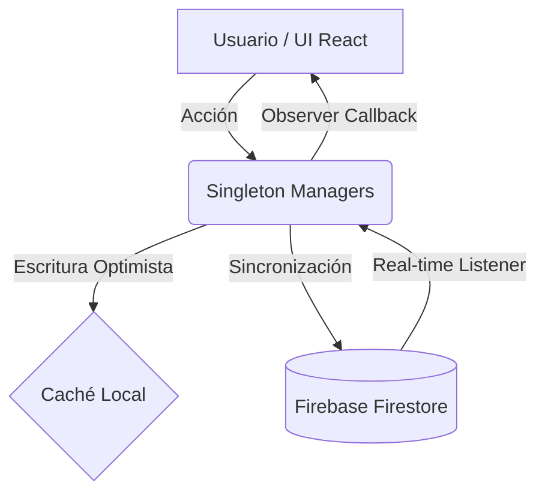

# 🚀 AppMasterThatOpenEngine


> **Plataforma colaborativa de alto rendimiento para la gestión de proyectos de construcción en tiempo real.**

**AppMasterThatOpenEngine** orquesta flujos de trabajo complejos, tableros Kanban interactivos y visualización de datos espaciales, utilizando una arquitectura orientada a servicios con sincronización bidireccional mediante Firebase.

---

## 📋 Tabla de Contenidos

- [🏗️ Arquitectura General](#️-arquitectura-general)
- [📚 Documentación Técnica (Deep Dive)](#-documentación-técnica-deep-dive)
- [🛠️ Stack Tecnológico](#️-stack-tecnológico)
- [📦 Instalación y Configuración](#-instalación-y-configuración)
- [✨ Módulos Principales](#-módulos-principales)
- [🚨 Solución de Problemas](#-solución-de-problemas)
- [🤝 Contribución](#-contribución)

---

## 🏗️ Arquitectura General

La aplicación se basa en un modelo de **Estado Centralizado** orquestado por Managers de tipo Singleton. El flujo de información garantiza la integridad de datos en tiempo real entre múltiples usuarios.



1. **Capa de Persistencia:** Firebase Firestore (Backend-as-a-Service).
2. **Capa de Lógica (Managers):** `ProjectsManager` y `UsersManager` gestionan la caché local y los listeners.
3. **Capa de UI:** Componentes React 18 que reaccionan a cambios mediante el patrón Observer.

---

## 📚 Documentación Técnica (Deep Dive)

Para facilitar la navegación por la ingeniería del sistema, hemos dividido la documentación técnica en módulos específicos. **Recomendamos leerlos en este orden:**

| Módulo                                                       | Icono | Descripción                                                                      |
| ------------------------------------------------------------ | ----- | -------------------------------------------------------------------------------- |
| **[Frontend Architecture](./docs/FRONTEND_ARCHITECTURE.md)** | ⚛️    | Jerarquía de componentes, Providers, Rutas Protegidas y Sistema de Diseño (CSS). |
| **[Backend Architecture](./docs/BACKEND_ARCHITECTURE.md)**   | ☁️    | Servicios Firebase, Esquema de Datos NoSQL y Seguridad con Cloud Functions.      |
| **[Data Flow & State](./docs/DATA_FLOW_AND_STATE.md)**       | 🔄    | Patrón Singleton, Flujo Unidireccional y Gestión de Estado Híbrida.              |
| **[Real-time Sync](./docs/REALTIME_SYNC.md)**                | ⚡    | Estrategia Offline-First, Listeners `onSnapshot` y Caché Local.                  |

---

## 🛠️ Stack Tecnológico

| Tecnología     | Versión   | Propósito                                            |
| -------------- | --------- | ---------------------------------------------------- |
| **React**      | `18.2.0`  | Biblioteca de UI basada en componentes.              |
| **TypeScript** | `5.4.5`   | Tipado estático para robustez y escalabilidad.       |
| **Firebase**   | `10.14.1` | Base de datos NoSQL en tiempo real y Auth.           |
| **Three.js**   | `0.152.2` | Motor de renderizado 3D para el sector construcción. |
| **@dnd-kit**   | `6.3.1`   | Motor físico de arrastre para el tablero Kanban.     |
| **Vite**       | `4.5.1`   | Bundler de nueva generación para desarrollo rápido.  |

---

## 📦 Instalación y Configuración

Sigue estos pasos para desplegar el entorno de desarrollo local:

### 1. Clonar y Dependencias

```bash
git clone [https://github.com/dbarberos/AppMasterThatOpenEngine.git](https://github.com/dbarberos/AppMasterThatOpenEngine.git)
cd AppMasterThatOpenEngine
npm install

```

### 2. Variables de Entorno

Crea un archivo `.env` en la raíz del proyecto con tus credenciales de Firebase:

```env
VITE_FIREBASE_API_KEY=tu_api_key_aqui
VITE_FIREBASE_AUTH_DOMAIN=tu_proyecto.firebaseapp.com
VITE_FIREBASE_PROJECT_ID=tu_project_id
# Consulta src/services/Firebase/index.ts para ver todas las claves

```

### 3. Ejecución

```bash
npm run dev

```

---

## ✨ Módulos Principales

### 1. Core Orchestration

Punto de entrada (`index.tsx`) que gestiona el ciclo de vida de los `Providers` y asegura que los Singletons (Managers) se inicialicen antes de renderizar la UI.

### 2. Gestión de Proyectos

Lógica centralizada en `ProjectsManager.ts` que implementa carga diferida de subcolecciones (`todoList`, `tags`) y optimización de caché en memoria para reducir lecturas a Firestore.

### 3. Kanban Engine

Tablero interactivo (`ToDoBoardPage.tsx`) potenciado por `@dnd-kit`. Sincroniza los movimientos de tareas (drag & drop) directamente con la base de datos en tiempo real.

### 4. Motor 3D (Three.js)

Integración de visualización espacial. Los componentes 3D consumen datos directamente del `ProjectsManager`, vinculando tareas del Kanban a coordenadas específicas en el modelo de construcción.

---

## 🚨 Solución de Problemas

### Error de Permisos en Firebase

> **Síntoma:** La consola muestra errores de "Permission denied" al inicio.
> **Solución:** Asegúrate de estar autenticado antes de que los Managers inicien la carga de datos. Revisa las reglas de seguridad en la consola de Firebase.

### La UI no se actualiza

> **Síntoma:** Creas una tarea pero no aparece sin recargar.
> **Solución:** Verifica que los métodos dentro de los Managers estén disparando el spread operator `setProjects([...projectsManager.list])`. React necesita una nueva referencia del array para detectar el cambio.

---

## 🤝 Contribución

¡Las Pull Requests son bienvenidas!

1. Fork el proyecto.
2. Crea tu rama (`git checkout -b feature/AmazingFeature`).
3. Commit tus cambios (`git commit -m 'Add some AmazingFeature'`).
4. Push a la rama (`git push origin feature/AmazingFeature`).
5. Abre una Pull Request.

```
