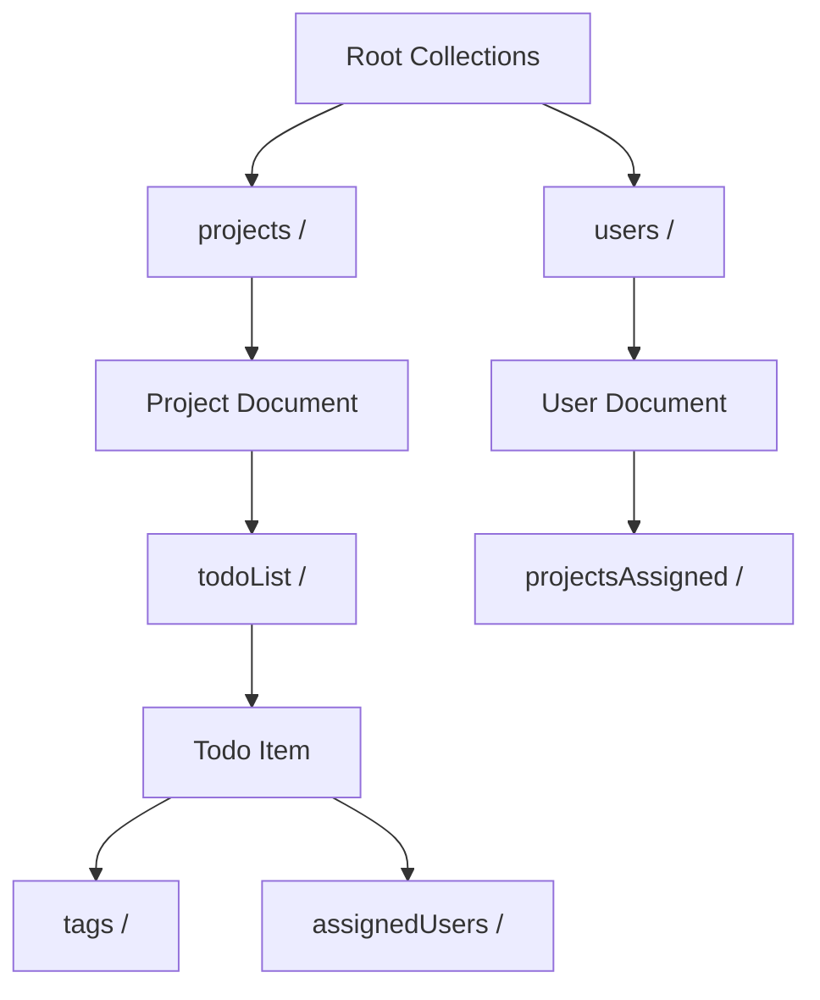
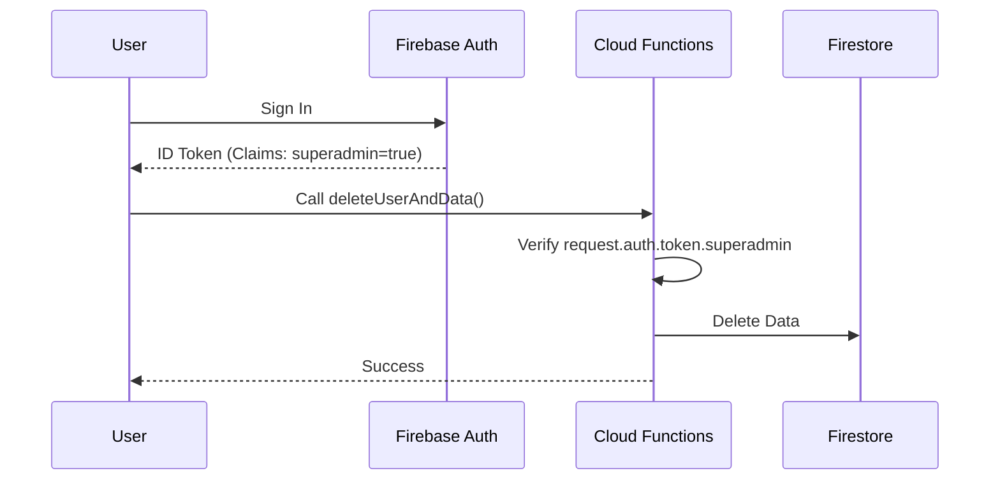

[← Volver a la Documentación Principal](../../README.md)

# ☁️ Backend Architecture & Firebase Services

> **Scope:** This document details the serverless backend architecture of **AppMasterThatOpenEngine**. It covers the Firestore schema design, Cloud Functions logic, the Service Layer abstraction, and real-time synchronization patterns.

---

## 1. Platform Overview (BaaS)

The application leverages **Firebase (Google Cloud Platform)** as a fully managed Backend-as-a-Service, eliminating the need for custom server infrastructure.

### Core Services Stack

| Service             | Purpose           | Key Implementation Details                                      |
| :------------------ | :---------------- | :-------------------------------------------------------------- |
| **Cloud Firestore** | NoSQL Database    | Nested subcollections (3 levels deep), Real-time listeners.     |
| **Authentication**  | Identity          | Email/Password auth, **Custom Claims** for RBAC (`superadmin`). |
| **Cloud Functions** | Server-side Logic | Privileged admin operations (User deletion, Role assignment).   |
| **Cloud Storage**   | File Storage      | Profile pictures (`users/`) and GLTF 3D models (`projects/`).   |

### Initialization & Resilience

Firebase is initialized in `src/services/Firebase/index.ts` using a **Singleton Pattern** with a robust **Retry Mechanism** to handle transient network failures.

```typescript
// Resilience Pattern (src/services/Firebase/index.ts)
export async function initializeFirebase() {
  return withRetry(
    async () => {
      // ... initializes Auth, Firestore, Storage
    },
    { maxRetries: 2, timeout: 5000 },
  );
}
```

````

---

## 2. Firestore Database Schema

The database uses a **Document-Oriented** structure with a hierarchical depth of 3 levels to encapsulate project complexities.

### Schema Hierarchy Diagram



### Data Type Handling (Timestamps)

Firestore stores dates as `Timestamp` objects. The Service Layer handles the bidirectional conversion automatically:

- **Read:** `Timestamp` JavaScript `Date` (via `toDate()`).
- **Write:** JavaScript `Date` `Timestamp` (via `Timestamp.fromDate()`).

---

## 3. Service Layer Abstraction

All Firebase interactions are decoupled from the UI through a comprehensive **Service Layer** (`src/services/Firebase/index.ts`). This layer handles type safety, error parsing, and retries.

### Core Service Methods

| Method                   | Signature           | Purpose                                                                                           |
| ------------------------ | ------------------- | ------------------------------------------------------------------------------------------------- |
| **getCollection**        | `<T>(path: string)` | Returns a typed reference with retry logic.                                                       |
| **createDocument**       | `<T>(path, data)`   | Handles auto-IDs, strips subcollections, and adds `createdAt`.                                    |
| **updateDocument**       | `<T>(id, updates)`  | Supports both main document and subcollection updates.                                            |
| **deleteDocumentByID**   | `(path, id)`        | Verifies existence before deletion.                                                               |
| **replaceSubcollection** | `(path, items)`     | **Atomic-like operation**: Deletes all docs in a subcollection and replaces them (used for tags). |

### Complex Querying

Fetching a project is not a single query. The `getProjectsFromDB()` function orchestrates a **Multi-Level Fetch**:

1. Query `projects/` collection.
2. For each project, query `todoList/`.
3. **Parallel Execution:** For each ToDo, fetch `tags/` and `assignedUsers/` concurrently.

---

## 4. Authentication & Security Model

### Architecture

The system uses **Firebase Auth** for identity and **Custom Claims** for authorization.



### Cloud Functions (Server-Side Logic)

Located in `functions/lib/index.js`, these callable functions handle operations requiring elevated privileges:

1. **`deleteUserAndData`**:

- **Security:** Checks `request.auth.uid` and `superadmin` claim.
- **Logic:** Recursively deletes user data from Firestore and Auth.
- **Constraint:** Superadmins cannot delete themselves.

2. **`setSuperadminClaim`**:

- **Security:** Only callable by an existing Superadmin.
- **Logic:** Assigns the `superadmin: true` claim to a target email.

---

## 5. Real-time Synchronization Engine

The backend pushes updates to the clients instantly using **Firestore Listeners** (`onSnapshot`).

### Listener Implementation (`ProjectsManager.ts`)

The `ProjectsManager` class establishes a persistent connection to the `projects` collection.

| Change Type  | Trigger             | Handler Action                                                     |
| ------------ | ------------------- | ------------------------------------------------------------------ |
| **added**    | New Project created | Instantiate `Project` class, trigger async load of subcollections. |
| **modified** | Project updated     | Merge fields, preserve local cache of `todoList`.                  |
| **removed**  | Project deleted     | Remove from local array and trigger UI update.                     |

### Retry & Resilience Strategy

Network instability is handled via a wrapper utility:

- **`withRetry<T>`**: Executes operations with **Exponential Backoff**.
- _Attempt 1:_ Immediate.
- _Attempt 2:_ 1000ms delay.
- _Attempt 3:_ 2000ms delay.

- **`withTimeout<T>`**: Prevents operations from hanging indefinitely (default 5000ms).

---
````
