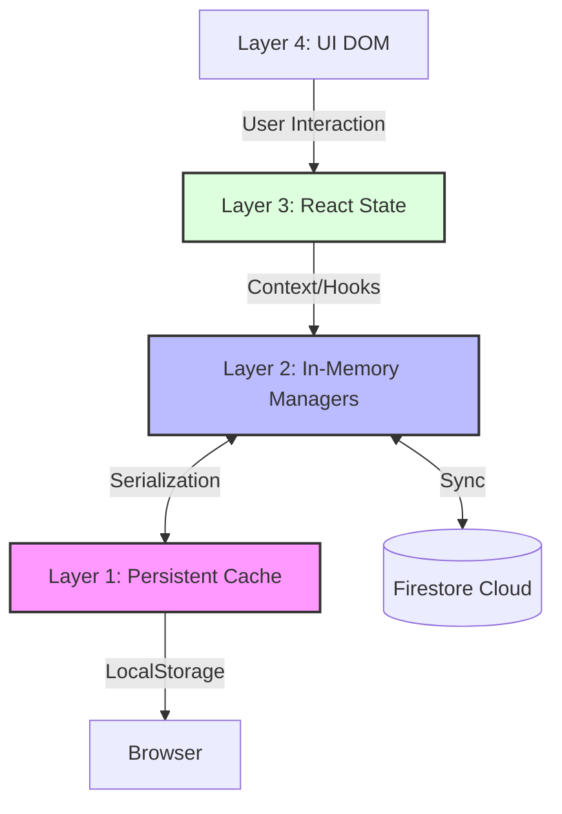
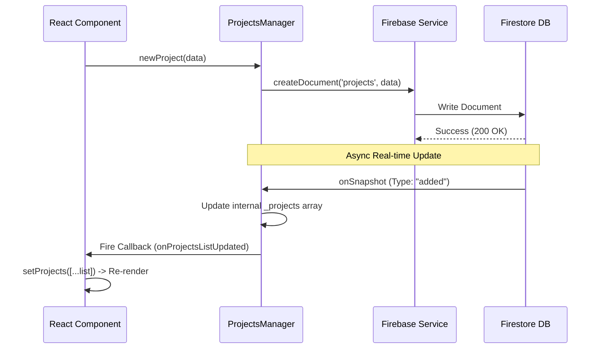
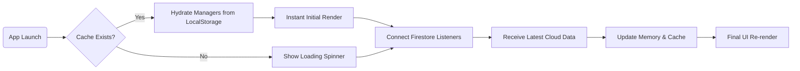

[← Volver a la Documentación Principal](../README.md)

# 🔄 Data Flow & State Management

> **Scope:** This document explains how data flows through **AppMasterThatOpenEngine**, from user interactions to database persistence and back to the UI. It covers the multi-layered state architecture, the **Observer Pattern** used by Managers, and the caching strategies.

---

## 1. Four-Layer State Architecture

The application implements a layered architecture to ensure separation of concerns, offline capabilities (via caching), and reactive UI updates.



| Layer                     | Component                | Responsibility                                                                                                | Persistence              |
| ------------------------- | ------------------------ | ------------------------------------------------------------------------------------------------------------- | ------------------------ |
| **1. Persistent Cache**   | `localStorage`           | Stores serialized data for **Instant Cold Start**. Persists UI preferences (Sidebar state, selected project). | Survives Browser Refresh |
| **2. In-Memory Managers** | `ProjectsManager.ts`<br> |

<br>`UsersManager.ts` | **Authoritative State**. Manages Firestore listeners, business logic, and CRUD methods. | Cleared on Reload |
| **3. React State** | Context API & Hooks | Provides Manager instances to components. Triggers re-renders via `useState` updates. | Cleared on Reload |
| **4. UI Presentation** | Components (DOM) | Displays data and captures events. | Transient |

---

## 2. Data Flow Principles

### Single Source of Truth

**Firestore is the absolute truth.**

- **No Direct Mutation:** Components never modify the local arrays (`_projects`) directly.
- **Flow:** Mutations go to Firestore Listener detects change Manager updates local state React re-renders.
- **LocalStorage:** Updated only _after_ Firestore confirms the change (or during snapshot processing).

### Write Operation Flow (The Cycle)



---

## 3. Manager Classes (The "Brains")

The logic is encapsulated in Singleton classes that act as state containers.

### `ProjectsManager`

Manages the lifecycle of Projects and their nested subcollections (ToDo Items).

- **Key Properties:** `_projects` (Array), `_isReady` (Boolean).
- **Key Methods:**
- `setupFirestoreListener()`: Binds to `projects` collection.
- `loadToDosForProject(project)`: **Lazy loads** `todoList`, `tags`, and `assignedUsers` subcollections.
- `updateLocalStorage()`: Serializes complex objects (Dates) to JSON strings.

### `UsersManager`

Manages Users and their relationships to projects.

- **Key Feature:** Maintains a `_projectAssignmentUnsubscribes` Map to manage dynamic listeners for the `projectsAssigned` subcollection of each user.

---

## 4. React Integration (The "Bridge")

We use the **Observer Pattern** to connect the imperative Manager classes with the declarative React UI.

### Callback Subscription Pattern

Components subscribe to manager events using `useEffect`. This avoids prop-drilling and complex Redux boilerplate.

```typescript
// Example: src/react-components/ProjectsPage.tsx
const projectsManager = useProjectsManager();
const [projects, setProjects] = React.useState(projectsManager.list);

React.useEffect(() => {
  // 1. Subscribe
  projectsManager.onProjectsListUpdated = () => {
    // 2. Force React Re-render with new reference
    setProjects([...projectsManager.list]);
  };

  // 3. Cleanup
  return () => {
    projectsManager.onProjectsListUpdated = null;
  };
}, [projectsManager]);
```

---

## 5. Cold Start & Caching Strategy

To provide an "App-like" feel, we load data from `localStorage` immediately while waiting for the network.

### Cold Start Flow



### Cache Serialization Keys

| Key                  | Content                                   | Trigger                     |
| -------------------- | ----------------------------------------- | --------------------------- |
| `projects`           | Serialized `Project[]` (with todos/tags). | After `onSnapshot` updates. |
| `projects_timestamp` | ISO Date String.                          | Used for debugging/TTL.     |
| `users`              | Serialized `User[]`.                      | After `onSnapshot` updates. |
| `selectedProjectId`  | Current active project ID.                | On navigation.              |

> **Note:** Dates in JSON (Strings) are automatically converted back to JavaScript `Date` objects during the hydration process in the Managers.

---

## 6. Operations Summary Table

A quick reference guide to how specific actions propagate through the system.

| Operation          | Entry Point         | Manager Method            | Firebase Action               | UI Refresh Trigger           |
| ------------------ | ------------------- | ------------------------- | ----------------------------- | ---------------------------- |
| **Create Project** | `NewProjectForm`    | `updateReactProjects()`   | `createDocument()`            | `onSnapshot` Callback        |
| **Update Project** | `ProjectCard`       | `updateProject()`         | `updateDocument()`            | `onSnapshot` Callback        |
| **Delete Project** | `DeleteBtn`         | `deleteProject()`         | `deleteDoc()`                 | `onSnapshot` Callback        |
| **Create User**    | `NewUserForm`       | `newUser()`               | `setDoc()`                    | `onSnapshot` Callback        |
| **Assign User**    | `AssignmentModal`   | `updateUser()`            | `replaceSubcollectionItems()` | `onSnapshot` (Subcollection) |
| **Create ToDo**    | `NewToDoIssueForm`  | `updateProjectToDoList()` | `createDocument()`            | `onSnapshot` Callback        |
| **Update ToDo**    | `ToDoDetailsWindow` | `updateToDoIssue()`       | `updateDocument()`            | `onSnapshot` Callback        |

---
