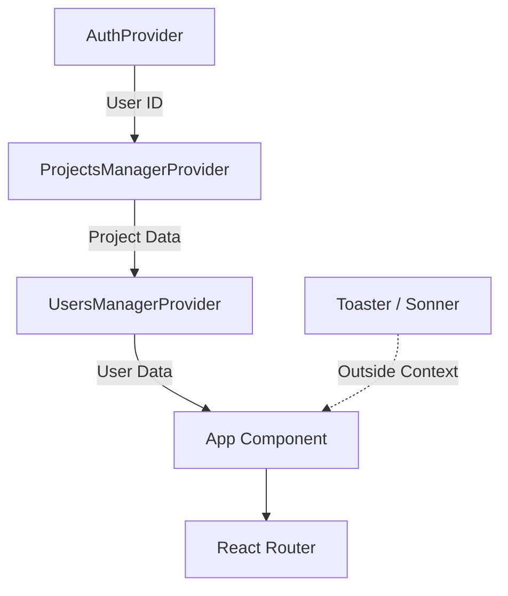

[← Volver a la Documentación Principal](../README.md)

# ⚛️ Frontend Architecture Documentation

> **Scope:** This document provides a deep dive into the React-based architecture of **AppMasterThatOpenEngine**. It details the dependency injection strategy, hybrid state management, routing logic, and the custom CSS-first design system.

---

## 1. Application Entry & Provider Hierarchy

The application bootstraps via `src/index.tsx`. The nesting order is **critical** to ensure dependency injection flows correctly from Authentication to Data Managers.

### Provider Nesting Strategy



| Provider                    | File Location                               | Purpose                                           | Dependencies                      |
| --------------------------- | ------------------------------------------- | ------------------------------------------------- | --------------------------------- |
| **AuthProvider**            | `src/Auth/react-components/AuthContext.tsx` | Manages Firebase Auth state & User Profile.       | None (Outermost)                  |
| **ProjectsManagerProvider** | `src/index.tsx`                             | Manages project data logic & Firestore listeners. | Needs `AuthContext` (User ID)     |
| **UsersManagerProvider**    | `src/index.tsx`                             | Manages user roles & team assignments.            | Needs `AuthContext` (Permissions) |
| **App Component**           | `src/index.tsx`                             | Routing coordinator and global layout.            | Access to all contexts            |

> **Critical Note:** The `Toaster` component (Sonner) is placed **outside** the providers to prevent context-related re-renders. It is configured with custom icons (Success, Warning, Error) directly in the entry point.

---

## 2. Component Hierarchy

The application follows a three-tier architecture to separate routing logic from presentation.

- **Tier 1: Coordinator** (`App`): Manages global callbacks and initial routing.
- **Tier 2: Layout** (`MainLayout`): Handles Auth-dependent logic (Sidebar + Content Grid).
- **Tier 3: Features** (`Pages`, `Forms`): Specific business logic.

### Directory Structure & Barrel Exports

Components are organized by feature domain and exported via `src/react-components/index.tsx` to allow clean imports:

```typescript
// Pattern: Barrel Export
// Location: src/react-components/index.tsx
export { Sidebar } from "./Sidebar";
export { ProjectsPage } from "./ProjectsPage";
export { ToDoBoardPage } from "./ToDoBoardPage";

// Usage
import { Sidebar, ProjectsPage } from "./react-components";
```

### Component Categories

| Category        | Examples                         | Purpose                            |
| --------------- | -------------------------------- | ---------------------------------- |
| **Pages**       | `ProjectsPage`, `ToDoBoardPage`  | Top-level route components.        |
| **Forms**       | `NewProjectForm`, `NewUserForm`  | Data entry modals with validation. |
| **Cards**       | `ProjectCard`, `ToDoCard`        | Reusable list item components.     |
| **Specialized** | `ToDoDetailsWindow`, `SearchBox` | Feature-specific UI elements.      |

---

## 3. Routing Architecture

Implemented with **React Router v6**. The system uses a **Protected Route Pattern** (`src/Auth/react-components/ProtectedRoute.tsx`) that verifies authentication and email status before rendering `<Outlet />`.

### Route Configuration

| Route Type    | Path                 | Logic / Guard                                                                    |
| ------------- | -------------------- | -------------------------------------------------------------------------------- |
| **Public**    | `/auth`, `/register` | Auto-redirects to `/` if already authenticated.                                  |
| **Protected** | `/`, `/project/:id`  | Checks `currentUser` & `emailVerified`. Redirects to `/auth` or Unverified Page. |
| **Nested**    | `/usersBoard/*`      | Uses `Outlet` pattern for child views (Teams, Roles).                            |

### 🧠 Sticky Navigation State (Advanced)

The Sidebar remembers the user's selected project across page reloads using a custom `useStickyState` hook.

- **Persistence:** Uses `localStorage` with key `selectedProjectId_${currentUser.uid}`.
- **Auto-Sync Logic:**
  It parses the URL to detect if the user navigated directly via link:

```typescript
// Logic in Sidebar.tsx
const potentialMatch = Router.matchPath(
  { path: "/project/:projectId", end: true },
  currentPath,
);
if (potentialMatch) {
  setSelectedProjectId(potentialMatch.params.projectId);
}
```

---

## 4. State Management (Hybrid Pattern)

We avoid Redux complexity by using a **Hybrid Approach** combining Singleton Classes for logic and React Context for binding.

| Layer         | Responsibility                                           | Pattern                                  |
| ------------- | -------------------------------------------------------- | ---------------------------------------- |
| **Managers**  | Data logic, Firestore listeners (`onSnapshot`), Caching. | Singleton Classes (`ProjectsManager.ts`) |
| **Context**   | Exposing Managers to the Tree.                           | React Context API                        |
| **Component** | UI State (Modals, Form inputs).                          | `useState` / `useReducer`                |

### Unidirectional Data Flow

1. **Write:** Component UI Manager Method Firestore.
2. **Read:** Firestore Listener Manager Update Context Trigger UI Re-render.

> **Performance Optimization:** To force React to re-render when an array inside a Manager changes (without changing the Manager instance), we use the spread operator pattern:
> `setProjects([...projectsManager.list])`

---

## 5. Styling System (CSS-First)

We avoid CSS-in-JS overhead by using native CSS Variables and a **Neumorphic** design language.

### Design Tokens (`style.css`)

Defined at the `:root` level for global access and theming.

```css
:root {
  /* Typography Scale */
  --font-xs: 10px;
  --font-2xl: 20px;

  /* Brand Colors */
  --primary: #029ae0;
  --background: #202124; /* Dark Mode Default */

  /* Layers */
  --background-l00: #26282b;
  --background-200: #3b3c3f;
}
```

### Key UI Patterns

- **Theme Switching:** Toggled via `.light-mode` class on `<body>`. Overrides `--background` and `--font-color` variables.
- **Neumorphism:** Buttons use complex box-shadows to simulate depth:
  `box-shadow: -7px -7px 15px var(--color-light), 7px 7px 15px var(--color-shadow);`
- **Grid Layout:** The main app layout uses CSS Grid. The sidebar contracts from `300px` to `105px` when collapsed.

---

## 6. UI Patterns & Portals

### Modal System

Modern React Portals are used to render modals outside the DOM hierarchy to avoid `z-index` and overflow clipping issues.

```tsx
// Portal Implementation Pattern
ReactDOM.createPortal(
  <div className="custom-backdrop">
    <div className="modal-content">{children}</div>
  </div>,
  document.body, // Mounts directly to body
);
```

### Forms Lifecycle

Forms (like `NewUserForm.tsx`) follow a strict lifecycle for data integrity:

1. **Init:** Pre-populate fields for Edit Mode.
2. **Tracking:** Compare current vs. new values (Dirty state detection).
3. **Diff Preview:** Show a summary of changes ("Before" vs "After") before submission.
4. **Feedback:** Toast notification via Sonner upon completion.

```

---
```
